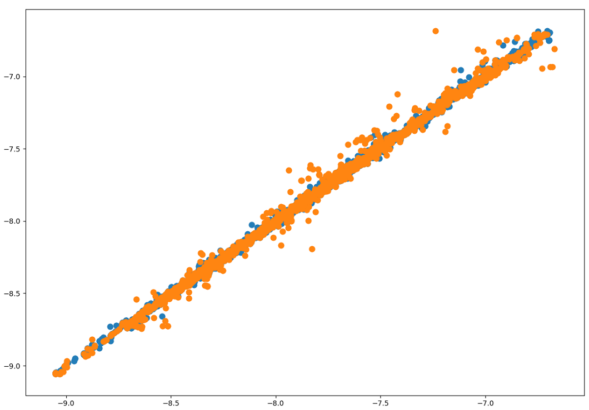
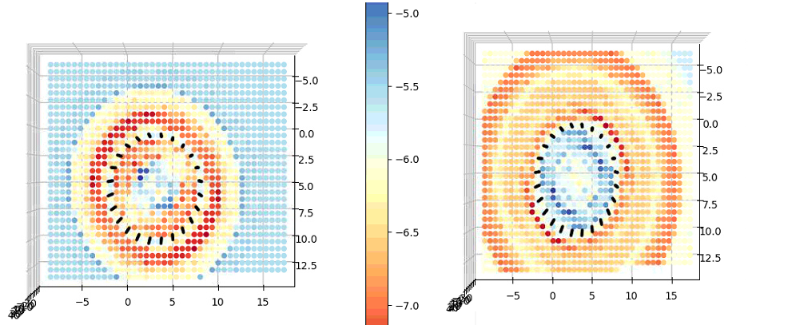
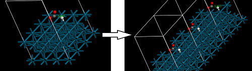

# README

**Read this document on gitbook:** [**https://wangbch.gitbook.io/soapml-document/**](https://wangbch.gitbook.io/soapml-document/)\*\*\*\*

## **soapml**


**\#TODO：除了函数调用，也要给出Dataset和Model的不同类型的Demo，比如训练，测试和生产环境使用的代码，以及用不同的输入创建Dataset，尽可能完善用例**

**\#TODO： 完成Model.Predict的内容**


soapml is based on SOAPLite: [https://github.com/SINGROUP/SOAPLite](https://github.com/SINGROUP/SOAPLite)

A machine learning tool for doing regression using SOAP \(smooth overlap of atomic position\) encoded structure of molecules, surface, ... Helps to find relationship between position and energy, activity and other physical chemical property.

## Demo

```python
# prepare data
data = ...
vasp_file_path, y = data
dataset = Dataset.from_vasp_dir_and_energy_list(vasp_file_path,final_ads_energy=y,
                                                    description="""
                                                    the carbon nanotube data,
                                                    doped with N or B,
                                                    adsorbate: OH
                                                    """)
    
dataset.sample_filter(ratio=0.15)
dataset.apply_period(direction=2,repeat_count=1)
dataset.soap_encode(center_atom_cases=[8],encode_atom_cases=[5,6,7])
dataset.save("dataset.smld")

# do machine learning
dataset = Dataset.load("dataset.smld")
model = Model(dataset)
model.fit_gbr(n_estimators=200,shuffle=True,test_split_ratio=0.3) 
model.save("model.smlm")
```

Result: average error 0.027, fig of model predicted\_y and true\_y



And we can predict the energy in any position, here we predicted OH\* adsorption energy on a plane, where z is equal to the z-coordinate of O atom:



## What can soapml do?

By training the data that contains the relation ship of e.g., **position-energy**, soapml can predict the energy on any position, make it possible to find some position with higher or lower energy.

## Can I use soapml now?

soapml is now supported for  _ΔE_ prediction of  a background structure \(slab\) with an active small group \(ads\). It should contain only one ads on the slab, and the position of ads has a big influence on _ΔE_, and _ΔE_ should be _E\(slab+ads\) - E\(slab\)._


_**Example:**  We have a background structure Pt\(111\) surface as slab, and we have one OH\* on the slab, OH\* moves on the slab freely. We need energy \(Ea, a vector\) of  every frame of OH\* on Pt\(111\) , and an energy \(Es\) of slab when it is optimized, ΔE will be Ea - Es ****\(known as adsorption energy\). Another feasible method is to use only the OH\* + slab structure and ΔE calculated in other ways._


## How to use soapml? -- Make input as dataset

_**You can make your input by soapml.Dataset,**_ soapml needs structure \(atom index and x y z coordinate\) and energy as input. It is now supported for **VASP results dir** \(the dir containing OUTCAR, CONTCAR, OUT.ANI of VASP\), and directly use **structure array list and energy array list**_**.**_ You can write something in param "description" to help you remember what the dataset is. _**You can use one of following method to make your input, they all return an instance of Dataset, and if you want to make only dataset of X \(when do prediction, you need to make dataset contains only X\), you need to give only\_x = True.**_

_**——————————**_

### 1. @static - Dataset.from\_vasp\_dir\_and\_energy\_table

_**\(vasp\_dir\_table, only\_x, description\)**_

First, give a dir containing many vasp dirs, these dirs have slab + ads structure. Use **@ static - Dataset.generate\_vasp\_dir\_energy\_table\(vasp\_dir, to\_csv\),** to generate a excel or csv table, you need to fill the table with **slab energy of every vasp dir,** like:

| Vasp Dirs | slab energy |
| :--- | :--- |
| Pt\_OH1 | 1.0 |
| Pt\_OH2 | 2.0 |
| Pt\_OH3 | 3.5 |

Then use **@static - Dataset.from\_vasp\_dir\_and\_energy\_table\(vasp\_dir\_table,description\)** and set vasp\_dir\_table to the excel or csv filename.

_**——————————**_

### **2. @static - Dataset.from\_vasp\_dir\_and\_energy\_list**

_**\(vasp\_dirs, slab\_energy, final\_ads\_energy,  only\_x, description\)**_

vasp\_dirs is a list of string containing your vasp dir path, slab energy or final\_ads\_energy is list that have same length of vasp\_dirs. **You can only give either slab\_energy or final\_ads\_energy:**



Regression target _Et_ will be: _**energy of every step**_ **-** _**slab\_energy**_



Regression target _Et_ will be: _**energy of every step - energy of final step + final\_ads\_energy**_. 




_**Example:**_ _If we have vasp\_dirs: \[Pt\_OH01, Pt\_OH02\], we can offer slab\_energy like \[-100.0, -102.0\], and the energy of Pt\_OH01, like \[-99.8, -98.7, -96.5\], will be used to be subtracted by -100 to get target energy \[0.02, 1.3, 3.5\], and the energy of Pt\_OH02, like \[-90, -89\], will get \[12, 21\]. But if we offer final\_ads\_energy like \[1.1, 2.1\], for energy on Pt\_OH01, target energy will be -99.8 - \(-96.5\) + 1.1 = -2.1, in this way, we got target energy \[-2.1, -1.2, 1.1\], and target energy on Pt\_OH02 is \[1.1, 2.1\]._


_**——————————**_

### 3. @static - Dataset.from\_coordinate\_and\_energy\_array

_**\(coordinate, energy, box\_tensor,  only\_x, description\)**_

Considering different samples may contain different atom number, the coordinate and energy are List of Array. The list length is n\_sample\_group, for each sample group, coordinate is an Array with shape \(n\_sample, n\_atom, 4\), and energy is an Array with shape \(n\_sample\), the 4 means \[atom\_index, x, y, z\], atom\_index can be obtained from the periodic table \(H:1, C:6, O:8, ...\).

Box\_tensor, or translation vector, is related to period structure, it can be seen as \[VectorA, VectorB, VectorC\] of the cell. The box\_tensor should be a list of 3x3 arrays, since different sample\_group may contain different cell, you have to offer different 3x3 arrays for each sample\_group.


_Box\_tensor can be directly extract from POSCAR in vasp or Material Studio._ 

\_\_


_**When you finished your input, you will get an instance of Dataset as return, and now you need following functions to do SOAP transform to prepare x and y for machine learning:**_

_**——————————**_

### 4. Dataset.sample\_filter

_**\(ratio\)**_

Take ratio = 0.15 for example, the first 15 % of samples in each sample group will be deleted. It helps we some sample are unstable in vasp results.


_People often use the sample from a vasp structure optimization process rather than dataset designed for machine learning, so there will be some strange structure at the beginning._


_**——————————**_

### 5. Dataset.apply\_period

_**\(direction,repeat\_count\)**_

For periodic structure, we need to repeat structure. Direction = 0, 1, or 2, means we will add VectorA, B or C \(in box\_tensor\) into all coordinates, repeat\_count means how long we need to repeat. 


_**Example:**_ _we have VectorA = \[10, 0, 0\], and repeat\_count = 2, we will add \[20, 0, 0\], \[10, 0, 0\], \[-10, 0, 0\] and \[-20, 0, 0\] into all coordinates, which means that all atoms moved along VectorA times 2, 1, -1, -2, \(if repeat\_count=3, it is 3, 2, 1, -1, -2, -3\), and if before we have only 5 atoms, after repeating, we have 5 \* \(4 + 1\) = 25 atoms._ 



_**When do we need to apply period? If the position we interested is very closed to the edge of cell, we need to repeat, also, if we set a large cut off, there may not be enough atom, we need to repeat \(e.g., our cell have a length of 0.5 nm, but cutoff is 1.2 nm, we need to repeat twice to make length to 1.5 nm.\)**_




_**——————————**_

### 6. Dataset.soap\_encode

_**\(center\_atom\_cases, encode\_atom\_cases, n\_max=8, l\_max=8, r\_cut=15.0, absent\_atom\_default\_position, relative\_absent\_position\)**_

In SOAP, we need to give a position that are highly related to energy.\(e.g. the position of O\* is important to OH\* adsorption energy on Pt\(111\)\) So how do we find the position? One way is to set the position by calculation the average position of atoms which have index in center\_atom\_cases. 


_For example, if we have H2O on Pt\(111\), and we set center\_atom\_cases = \[8\], then our center position will be the position of O, if we set set center\_atom\_cases = \[1\], center position will be the average position of two H and if we set to \[1,8\], the position is average position of H2O._



_**ONLY position of atoms in original structure are allowed to be used to get center position \(repeated atoms are only for local environment feature.\)**_


n\_max=8, l\_max=8, r\_cut=15.0 are parameter of SOAPLite

And for encoding local environment, some atoms should not be included, e.g. if we use position of OH\* \(on Pt\(111\)\) as center position, its environment should not contain OH\* itself, so encode\_atom\_cases should be \[78\] rather than \[1,8,78\]. But what if there's no atom in encode\_atom\_cases? These absent atoms' position will be set into absent\_atom\_default\_position, but there are two ways to set that position, you can switch it by setting different bool value of relative\_absent\_position:



The position of atom not in encode\_atom\_cases will be set into _**absent\_atom\_default\_position**_



The position of atom not in encode\_atom\_cases will be set into _**the first center\_position - absent\_atom\_default\_position**_




_**For example, we have OH\* on three different carbon nanotube, C, B and N. C are pure nanotube, B are doped with element B, N are doped with element N. So we set center\_atom\_cases = \[8\], and encode\_atom\_cases = \[5,6,7\]. For C, there is no B \(atom case=5\) atom, so we will add a virtual B in the position of absent\_atom\_default\_position or \[-10,-10,-10\] to the center position if absent\_atom\_default\_position is not set \(this virtual B is far enough because the distance to center position is larger than cut\_off we set.**_ 



Usually we should set the position of absent atom as far away from center position as possible, and the default value is \[-10,-10,-10\] off the center position. _**But in my case, set \[-10, -10, -10\] got a much better result than set to \[-30, -30, -30\], don't know why this happen.**_


_**——————————**_

### 7. Dataset.save

_**\(filename\)**_

Dataset will be saved to soapmlDataset file \(.smld\) using pickle. **It's highly recommended to save your dataset and load it before train a machine learning model, since it takes to much time to do SOAP encoding.**

_**——————————**_

### **8. @static - Dataset.load**

_**\(filename\)**_

Load dataset instance from the soapmlDataset file \(.smld\).

## How to use soapml? -- Use dataset to do machine learning

_**use soapml.Model and give a soapml.Dataset to train model, test model and save model. There are 4 stages to use soapml.Model, and their process are:**_



1. _**Make a Dataset containing X and Y, and encode them**_
2. _**Offer the Dataset in Model, and fit**_



1. _**Make a Dataset containing X and Y, but do not encode them**_
2. _**Load a trained model from Model.Load**_
3. _**Use Model.encode\_before\_predict to give the dataset and encode with the same config as in train process**_
4. _**Run Model.predict and offer the encode Dataset, will return Y and plot out predicted Y - true Y**_



1. _**Make a Dataset containing only X, and this X must be a list of array \(Vasp results dir input is not supported -- since you have done using vasp, you need not to do soapml\)**_
2. _**Load a trained model from Model.Load**_
3. _**Use Model.encode\_before\_predict to give the dataset and encode with the same config as in train process**_
4. _**Run Model.predict and offer the encode Dataset, and this time you have other ways to make center position.**_



_**——————————**_

### 1. Model.init

_**\(dataset\)**_

_**You need to offer a soapml.Dataset to create model. You can feed a dataset with both X and Y or only X \(remember to set only\_x = True\).**_ 

_**——————————**_

### 2. Model.keep\_data\_larger\_than & Model.keep\_data\_smaller\_than

_**\(y\)**_

Keep data that have y larger/smaller than a threshold_**.**_


_**Example:**_ _We have samples which mainly is in range -10 to -6, but there are some sample are -20, so we can use **keep\_data\_larger\_than\(-11\)** to delete samples with smaller than -11 energy._


_**——————————**_

### 3. Model.fit\_gbr

_**\(test\_split\_ratio, n\_estimators, shuffle\)**_

Use gradient boost regression \(gbr\) model to fit x and y in dataset, error and a fig of predicted\_y - true\_y will print out. _**test\_split\_ratio**_ means we use how many dataset to train and test \(e.g., 0.3 means we use 70% data to train and use 30% data to test.\), _**n\_estimators**_ is the parameter of gbr, shuffle is a bool, which means if we shuffle the dataset or not. 


_**Shuffle or not shuffle?** Take a real case of carbon nanotube for example, if we not shuffle, test set may contain some nanotube structure which is very different from structure in train set, that "test" is really a hard "test". But if we shuffle, even we use only  30% data to train and 70% data to predict, we still can get very good results._ 

_**And if we choose not to shuffle, we need to decide what is our trainset and what is testset.**_


_**——————————**_

### **4. Model.predict**


**this part haven't finished yet.**

\*\*\*\*

* [ ] predict from Dataset
* [ ] predict from position

\#TODO: give a dataset or coordinate, center position, ... to encode and predict energy


_**——————————**_

### 5. Model.save

_**\(filename\)**_

Model will be saved to soapmlModel file \(.smlm\) using pickle. Save and keep your model well, one day it will be useful.

_**——————————**_

### **6. @static - Model.load**

_**\(filename\)**_

Load model instance from the soapmlModel file \(.smlm\).

## Advance Example - SOAP "Probe"

* prepare a surface and an adsorbate \(e.g. H\) as "Probe".
* get energy of surface without probe Es, move probe on the surface, get energy list Ep\_l. \(from DFT calculation...\)
* now you have structures of different probe position on surface as X, Ep\_l - Es as y
* use SOAPTransformer to transform X to features, the position of probe is as center position
* use ML models, like Gradient Boost Regression. Use soap features and y to train the model, save the model
* give a new surface, give many center positions, use SOAPTransformer to get features, and used saved gbr model to give energy.
* plot out.
* e.g. use atom H as probe, nanotube as surface, calculate  absorbation energy of H, got dataset, and use model to predict energy on a plane on the center of nanotube\(red is high energy, blue is low energy\):  

  

